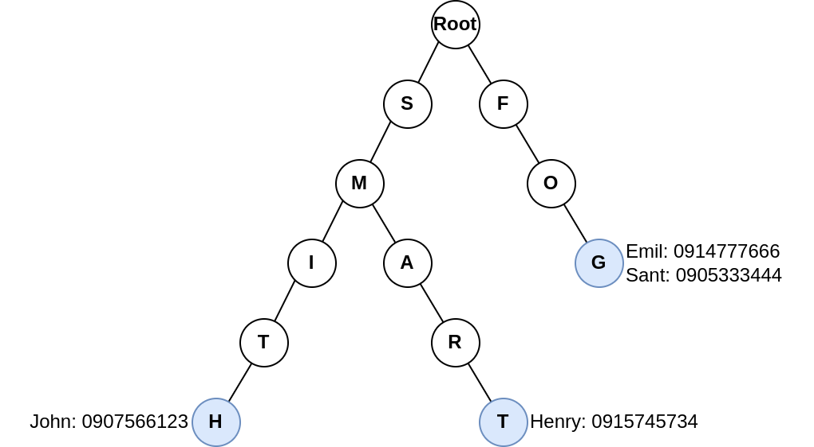

# PEVŠ DSA 2025 - Semestrálne zadanie 1 - Telefónny zoznam


[](https://classroom.github.com/classrooms)
[](https://dsa.interes.group)

Cieľom zadania je implementovať jednoduchú aplikáciu telefónneho zoznamu pomocou jazyka C++ (štandard C++17).

Telefónny zoznam je ukladaný do štruktúry prefixového stromu (Trie).
[Viac o prefixovom strome sa viete dočítať tu](https://en.wikipedia.org/wiki/Trie), [alebo si môžte inšpirovať úlohou cvičenie 4](https://dsa.interes.group/exercises/exercise-4/task-4-2/). V Trie sú indexované priezviská ľudí vložený do telefónneho zoznamu. Na konci priezviska (indexovaného slova) je uložená štruktúra, ktorá mapuje krstné meno osoby na telefónne číslo.



Na diagrame vyššie je uvedený príklad prefixového stromu (modrým sú označené konce slov v strome) telefónneho zoznamu, v ktorom sú vložené 4 záznamy (mená s telefónnymi číslami):

- John Smith - 0907566123
- Henry Smart - 0915745734
- Emil Fog - 0914777666
- Sant Fog - 0905333444

Aplikácia ponúka aj mód telepredajcu, ktorý musí zatelefonovať určitým ľuďom. Po vyhľadaní telefónneho čísla ho može používateľ zaradiť do fronty telefónnych čísel. Používateľ si tak môže vypýtať telefónne číslo, ktoré je na rade na zatelefonovanie. Následne používateľ môže odkliknúť, že na číslo zatelefonoval a zobrazí sa mu ďalšie telefónne číslo v poradí.

Aplikácia má iba terminálový používateľské rozhranie, komunikuje s používateľom cez štandartný vstup a výstup.

## Funkcionalita

Program umožní používateľovi spravovať vlastný telefónny zoznam a následne tieto čísla pridať do fronty pre účeli telefonickej fronty.
Po zapnutí ukáže program používateľovi menu ovládacích prvkov:

1. Pridaj číslo
2. Nájdi číslo
3. Vymaž číslo
4. Pridaj číslo do telefonickej fronty
5. Začni telefonickú frontu

### Pridaj číslo

Ak používateľ zvolí možnosť pridania nového telefónneho čísla, program od používateľa vypýta vstupy:

- Priezvisko osoby
- Krstné meno osoby
- Telefónne číslo osoby

Na základe vstupov, program uloží osobu s jej telefónnym číslom do _Trie_ štruktúry. Všetky vstupy môžu byť typu string a nemajú stanovený formát, či obmedzenie veľkosti.
V prípade chyby vstupu alebo chyby spracovania, túto chybu program vypíše používateľovi a vráti ho na úvodné menu.
Nemusíte validovať, či telefónne číslo má správny tvar. Prázdny `string`, alebo `string` pozostávajúcich iba z prázdnych znakov (t.j. medzera, tabulátor a pod.) nie je akceptovaný ako platný vstup. Po úspešnom uložení nového záznamu je používateľovi vypísaná správa o úspešnom uložení a následne je vrátený na úvodné menu.

### Nájdi číslo

Ak si používateľ zvolí možnosť vyhľadania telefónneho čísla, program od používateľa vypýta vstup typu `string` pre zadanie **priezviska**.
Ak sa zadané priezvisko v štruktúre nenachádza vypíše program chybovú správu používateľovi.

V prípade nájdenia priezviska v štrutkúre telefónneho zoznamu, program vypíše zoznam krstných mien, pre dané priezvisko.
Používateľ si následne môže zvoliť niektoré z vypísaných krstných mien. Po výbere sa vypíše používateľovi celý záznam zoznamu v tvare:

```txt
<Krstné meno> <Priezvisko> - <Telefónne číslo>
```

Následne je používateľ vrátený do úvodného menu.

### Vymaž číslo

Ak si používateľ zvolí možnosť vymazania telefónneho čísla, program najprv **prejde procesom nájdenia žiaducej osoby** a jej telefónneho čísla.
Program tak prechádza rovnakými krokmi ako pri možnosti _"Nájdi číslo"_ (t.j. zadanie priezviska, vybranie krstného mena, vypísanie čísla).
Ak je teda telefónne číslo úspešne nájdené a záznam je vypísaný, program od používateľa vypýta vstup pre potvrdenie vymazania vypísaného záznamu z telefónneho zoznamu.

- Ak používateľ potvrdí vymazanie, záznam je vymazaný zo štruktúry telefónneho zoznamu.
- Ak používateľ vymazanie nepotvrdí, nič sa so záznamom nestane.

Používateľ je následne vrátený na úvodné menu.

### Pridaj číslo do telefonickej fronty

Ak si používateľ zvolí možnosť pridania čísla do fronty čísel, program najprv **prejde procesom nájdenia žiadúcej osoby** a jej telefónneho čísla.
Program tak prechádza rovnakými krokmi ako pri možnosti _"Nájdi číslo"_ (t.j. zadanie priezviska, vybranie krstného mena, vypísanie čísla).
Ak je teda telefónne číslo úspešne nájdené a záznam je vypísaný, program od používateľa vypýta vstup pre potvrdenie pridania čísla do fronty.

- Ak používateľ potvrdí pridanie, záznam je pridaný do telefonickej fronty.
- Ak používateľ pridanie nepotvrdí, nič sa so záznamom nestane.

Používateľ je následne vrátený na úvodné menu.

### Začni telefonickú frontu

Ak si používateľ zvolí možnosť práce s telefonickou frontou je mu vypísaný záznam z telefónneho zoznamu, ktorý je práve na rade. Vypísanie záznamu má rovnaký formát pri vyhľadaní záznamu.
Po vypísaní má používateľ na výber 2 možnosti:

- Potvrdenie, že používateľ na telefónne číslo zavolal. Program tak odstráni aktuálny záznam z fronty a vypíše ďalší záznam, ktorý je na rade vo fronte. Ak sa vo fronte už žiadny záznam nenachádza, je na túto skutočnosť používateľ upozornený a je vrátený na úvodné menu.
- Ukončenie práce s frontou. Program používateľa vráti na úvodné menu.

## Implementácia

V rámci implementácie programu môžte použiť všetky štandardné knižnice a funkcie jazyka C++, v štandarde C++17. Pre implementáciu štruktúr môžte použiť knižnice STL (ako vector, queue, map a ďalšie).

Štruktúru prefixového stromu (Trie) implementujte pomocou tried. Využite princíp enkapsulácie/zapúzdrenia v implementácií tried. **Môžeme predpokladať**, že uložené **mená**, resp. pridávané mená, **sú unikátne**. V prípade pridanie nového záznamu, ktorého osoba sa nachádza už v štruktúre je existujúci záznam nahradený novým (t.j. pre jedno unikátne priezvisko a krstné meno pripadá jedno telefónne číslo).

Implementácia môže byť umiestnená v jednom súbore, `main.cpp`. V prípade rozdelenie kódu do viacerých súborov, nezabudnite pridať tieto zdrojové súbory do príkazu `add_executable` v rámci súboru _src/CMakeLists.txt_ aby boli skompilované s celým programom.

Pre kontrolu kompilácie je v repozitáry nastavená automatizácia cez GitHub pipeline. Pipeline sa spustí automaticky pre každý `git push` do vetvy `main`. GitHub pipeline sa pokúsi kód v repozitáry z posledného commitu skompilovať a následne spustiť. Pipeline je možné spustiť ľubovolný počet krát. Spustenie pipeline je možné vidieť v záložke "Actions" vo vašom repozitáry vypracovania zadania.

## Hodnotenie

Zadanie je **ohodnotené 20 bodmi**. Odovzdanný program musí byť skompilovateľný (kompilátorom GCC) a spustiteľný, inak je hodnotený 0 bodmi. Pri vypracovaní zadania sa kontroluje originalita vypracovaní a všetky vypracovania **so zhodou vyššou ako 80% sú hodnotené 0 bodmi**. Hodnotený bude iba posledný commit vo vašom repozitáry zadania, ktorý bol urobený do termínu odovzdania. Pri hodnotení vypracovania sa bude prihliadať na:

- práca so štrutkúrami
- využitie STL knižníc
- práca s pamäťou (alokácia a uvoľnenie pamäte)
- využitie tried (použitie princípov enkapsulácie)
- využitie podmienok/control flow (if, if-else a pod.)
- korektnosť kódu
- prezentácia údajov používateľovi

## Odovzdanie

Po prihlasení sa na zadanie cez [GitHub Classroom](TODO) vám je automaticky vytvorená kópia repozitára, ktorý bude nastavený ako privátny pre vás na vypracovanie (t.j. máte povolený commit a push do repozitára). Skontrolujte si, či sa váš repozitár nachádza pod skupinou _Interes-Group_, inak vyučujúci nemajú prístup ku vášmu repozitáru a zadanie sa nepovažuje za odovzdané. Ak sa vám repozitár nevytvorí ihneď kontajktuje vyučujúceho na MS Teams alebo na univerzitnom emaily. Je prísne zakázané dávať prístup k vášmu repozitáru inému štundetovi, alebo osobe, ktorá nie je vyučujúci.

V repozitáry upravujte iba súbory pod priečinkom `src`. Ostatné súbory je zakázané upravovať, predovšetkým súbory pre kompiláciu, súbory obsahujúce github pipeline-y (_.github_) a súbory obsahujúce automatizované testy. Pri zmene týchto súborov môže byť vypracovanie ohodnotené 0 bodmi.

Vypracovanie zadania priebežne commitujte/pushujte do repozitára vytvoreného GitHubom pre toto zadanie. Váš kód commitujte/pushujte do vetvy `main`. Hodnotený bude posledný commit/push do termínu odovzdania vypracovania.
Vypracovanie je **nutné odovzdať**/commitnúť/pushnúť do repozitára **do 25.03.2025 23:59**. Neodovzdanie je hodnotené 0 bodmi.

V prípade otázok, alebo technických problémov môžete kontaktovať vyučujúcich na MS Teams alebo na univerzitnom emaily.

## Bonus - Detekcia mŕtveho čísla (2b)

Rozšírte hodnotu, ktorá je indexovaná v prefixovom strome. Okrem telefónného čísla pre danú osobu ukladajte aj pre dané telefoné číslo počet koľko krát osoba na telefonnom čísle zodvihla pri pokuse o telefonát a počet, koľko krát osoba telefónne číslo nezdvihla. Tieto počty pridajte aj do výpisu záznamu pre funkcionality vyhľadania telefónneho čísla.

Rozšírte možnosti telefonickej fronty tak, aby keď používateľ zvolí možnosť _"Začni telefonickú frontu"_ a program vypíše záznam s telefónnym číslom, ktoré je na rade pre telefonát, tak namiesto potvrdenia, či používateľ zavolal na dané telefónne číslo, sa mu zobrazia dve voľby:

- **Osoba zodvihla hovor** na uvedenom telefónom čísle - Program tak zvýši počet zodvihnutí pre dané telefónne číslo v telefonom zozname o jeden.
- **Osoba nezodvihla hovor** na uvedenom telefónom čísle - Program zvýši počet nezodvihnutí pre dané telefónne číslo v telefonnom zozname o jeden. Ak tento počet dosiahne hodnotu 3, záznam s daným telefónnym číslom je vymazaný z telefónneho zoznamu. O tejto skutočnosti vymazania záznamu je upozornení používateľ.

Po zvolení jednej s vyššie uvedených možností program pokračuje na ďalšie číslo vo fronte ako bolo uvedené v pôvodnej funkcionalite.
